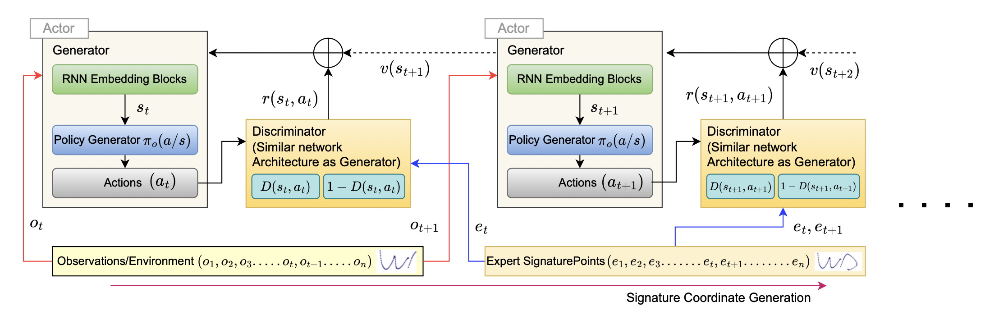

# RL-Signer : Generative Adversarial Model For Online Signature Imitation

### INTRODUCTION:
A novel framework RL- Signer, using generative adversarial imitation learning (GAIL) for online signature generation.
This repository include implementations of :

 - RL-Signer based on Generative Adversarial Imitation Learning.
 - RNN based Signature generator.
 - ShortestPath World (MDP for routing imitations)

<br>


Fig 1: Architecture representation of RL-Signer framework with two continuous state st and st+1 generation in concatenation. Reward is defined as a part of policy network with RNN.


### DATA AVALAIBILITY:
Two online signature datasets are used in this approach, ensuring good intra-user variance.

 - MCYT 
 - Biosecure-ID

 Signatures were captured across sessions on different OEM devices to provide sufficient input diversity. The data includes (X, Y ) coordinates, pressure values, and timestamps. Coordinates with zero pressure, indi- cating no pen contact, were removed. To address redundancy caused by the e-pads’ high 200Hz sampling frequency, repet- itive captures were removed during data preparation.


### REQUIREMENTS:
python>3.7

required python packages in requirement.txt

<Bash terminal>
 
```bash
pip install -r requirement.txt
```


### HOW TO RUN:

<Bash terminal>

To run RL-Signer

```bash
python inference.py
```

### RESULT:


Fig 2: Result representation of actual and generated 2D Signature through RL-Signer after training for different Episodes.


